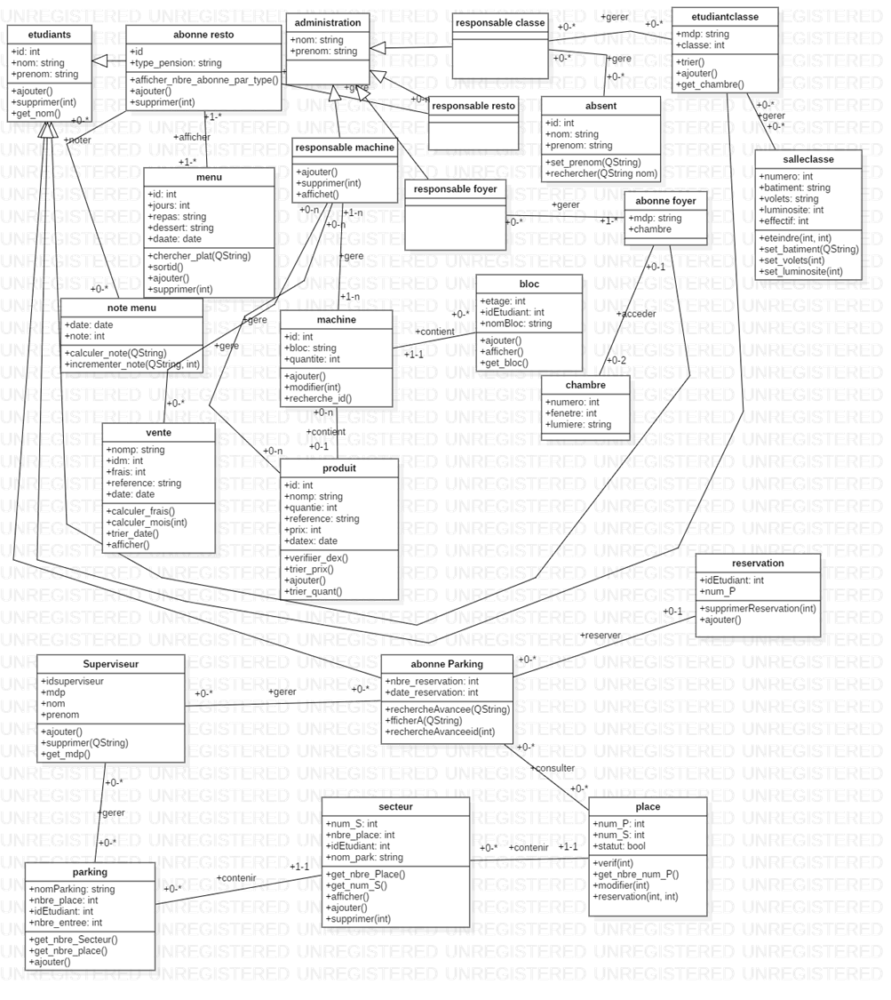

# Smart University Management – C++ / Qt

Application desktop de gestion universitaire intelligente développée en C++ avec Qt.

## Fonctionnalités
- Gestion des étudiants, classes, salles
- Statistiques et visualisation (QCustomPlot)
- Connexion base de données (Oracle SQL)
- Intégration Arduino (communication série)
- Interfaces graphiques Qt (Widgets)

## Technologies
- C++
- Qt (Qt Widgets, Qt Designer)
- Oracle SQL
- QCustomPlot
- SVN (versioning académique)

## Aperçu

Les captures d’écran sont disponibles dans `docs/screenshots`.

## Build
Projet développé avec **Qt Creator**.

## Architecture & Modèle métier

Diagramme UML représentant les principales entités du système
(etudiants, classes, parking, restauration, ventes, statistiques, etc.).

